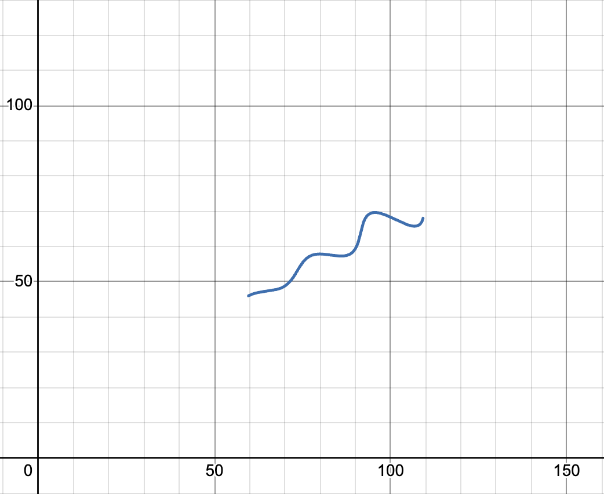

# Curve Parameters — R&D/AI Assignment

## The answer

theta = 30 degrees (0.5236 rad)
M = 0.03
X = 55

Desmos expression (paste into a new graph, then set the t-domain to 6 to 60):

```
\left(t*\cos(0.5236)-e^{0.03\left|t\right|}\cdot\sin(0.3t)\sin(0.5236)+55,42+t*\sin(0.5236)+e^{0.03\left|t\right|}\cdot\sin(0.3t)\cos(0.5236)\right)
```

Here's what it looks like plotted:



## The problem, in plain terms

We were given a formula with three unknown numbers in it (theta, M, X) and a CSV of 1500 x,y points that supposedly sit on that curve. No indication of which point goes with which value of the curve's parameter `t` — just a pile of coordinates. The job was to work backward and figure out what theta, M and X had to be.

## How I actually approached it

My first instinct was to just throw an optimizer at it — pick some starting guess for theta, M, X, generate a curve, measure how far the data points are from it, and let scipy minimize that. That works in principle but it's messy: for every guess of the three parameters you also have to figure out which point of your generated curve is "closest" to each of the 1500 data points, which is slow and can get stuck in weird local minima.

Before doing that I looked at the equations for a minute, because they seemed like they had more structure than a random blob of trig functions.

```
x = t*cos(theta) - e^(M|t|)*sin(0.3t)*sin(theta) + X
y = 42 + t*sin(theta) + e^(M|t|)*sin(0.3t)*cos(theta)
```

If you move X and 42 to the other side, this is literally the formula for rotating a 2D point by an angle theta. The point being rotated is `(t, e^(M|t|)*sin(0.3t))`. So really the "shape" of the curve, before any rotating or shifting, is just a plain graph — t on one axis, that exponential-wiggle thing on the other. Someone drew that on paper, spun the paper by theta degrees, and slid it over by (X, 42). That's the whole curve.

That matters because rotations are invertible. If I take a data point and apply the *opposite* rotation, I get back the original (t, wiggle) pair — and the first number in that pair is literally t itself. So instead of guessing t for every single point, I get t for free just by rotating the point backward. The catch is I still need theta and X to know how much to un-rotate and un-shift by — so there's a bit of circularity, but it's a much smaller problem now: only theta, M and X need to be searched for, not t for every point.

So the fitting problem became: pick theta, M, X so that when you un-rotate/un-shift every data point, the second coordinate you get matches `e^(M*t) * sin(0.3*t)` as closely as possible, where t is the first coordinate you got from the same un-rotation. That's a normal 3-parameter least squares problem, which scipy handles fine.

One thing to watch for with this kind of problem is local minima — bad starting guesses can converge to a plausible-looking but wrong answer. So I ran the fit from a grid of about 1750 different starting points spread across the allowed ranges for theta, M and X, and kept whichever run had the lowest error.

## Checking the answer

The optimizer converged to theta = 30°, M = 0.03, X = 55, and the residual error was basically zero (around 1.8e-8), not just "small." Plugging those numbers back into the original formula and comparing against the CSV gives an average error around 0.000003 — that's floating point rounding, not a real mismatch. The t values I recovered for all 1500 points also landed between 6.05 and 60.0, matching the 6 < t < 60 range given in the assignment.

Given how clean the numbers came out (30, 0.03, 55 — not 29.87 or some ugly decimal) and how small the error is, I'm fairly confident this is the exact set of values the data was generated with, not just a close approximation.

## How to run it

You need Python 3 with numpy and scipy installed. If you don't have them:

```
pip install numpy scipy
```

Then just run the script from inside this folder (it expects `xy_data.csv` to be sitting right next to it):

```
python3 solve.py
```

It'll print something like this:

```
theta = 29.999973 deg  (0.523598 rad)
M     = 0.030000
X     = 54.999998
sum of squared residuals = 1.823e-08
mean L1 reconstruction error = 3.497e-06
recovered t range = [6.049, 59.995]
```

Takes a couple seconds to run since it tries ~1750 different starting points before settling on the best fit.

## Files here

- `solve.py` — the script that does the fitting, run with `python3 solve.py` (needs numpy + scipy)
- `xy_data.csv` — the data we were given
- `desmos_graph.png` — the curve rendered in Desmos using the values above

